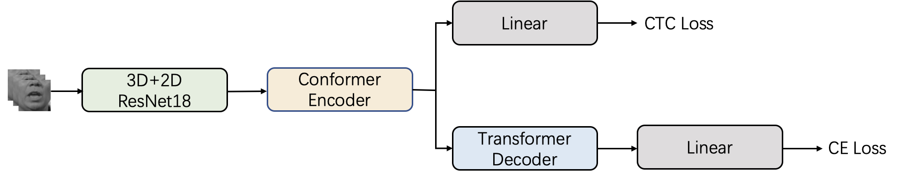

<h1 align="center">MAVSR2025 Track1 Baseline</h1>

## Introduction

The repository is the baseline code for the MAVSR2025 Track1 competition, designed to accomplish a basic lip reading task. The model architecture is as follows:



## Preparation

1. Install dependencies:

```Shell
# install accelerate
pip install accelerate
# install pytorch torchaudio torchvision
pip install torch==1.12.1+cu113 torchvision==0.13.1+cu113 torchaudio==0.12.1 --extra-index-url https://download.pytorch.org/whl/cu113
# install other dependence
pip install -r requirements.txt
```

2. Download and preprocess the dataset:

Enter `data_preparation` for data processing and preparation:

Download CAS-VSR-S101 and place it in `data/CAS-VSR-S101_zip/lip_imgs_96` for processing:

```Shell
python zip2pkl_101.py
```

Prepare the labels required for training:

```Shell
python create_labels.py
```

Download MOV20 and place it in `data/MOV20_zip/lip_imgs_96` for processing:

```Shell
python zip2pkl_mov20.py
```

## Training

Build the vocabulary (Note: we default to removing punctuation marks for training):

```Shell
cd data_meta/
# build vocabulary
python build_mapping_tokenizer.py
# get val/test ground truth
python get_trans.py
```

Modify the corresponding parameters in the `cfg` configuration file:

- Ensure that `dset_dir` and `trans_dir` point to the dataset path and the label directory, respectively.
- Modify the vocabulary size `vocab`.
- Use `max_len` (1000), which indicates that we only samples with frame lengths below 1000 frames will be used for training and inference.

Train a model:

```Shell
bash run_chinese_baseline.sh
```

Specify parameters in `run_chinese_baseline.sh`:

* Specify the path to the `accelerate` configuration file `acc_cfg`.

* Choose the model configuration file `cfg_ph`.

* Specify the number of GPUs `ngpu`.

## Inference

Validation and Testing:

```Shell
bash run_chinese_baseline_test.sh
```

**Specify parameters in `run_chinese_test.sh`:**

- Choose the model from the `train_path` directory for inference
- Specify the model configuration file `cfg_ph`.
- Perform validation on the trained models within the range from `--start_epoch` to `--end_epoch`.
- Test by averaging the top `--nbest` models from the first `--model_average_max_epoch` epochs.

## Results

The table below lists the results of the baseline model trained on CAS-VSR-S101, showing the performance on different validation and test sets:

| Training Data | Inference Data | CER on val | CER on test |
| :-----------: | :------------: | :--------: | :---------: |
| CAS-VSR-S101  |  CAS-VSR-S101  |   55.07%   |   47.74%    |
| CAS-VSR-S101  |     MOV20      |   93.05%   |   91.73%    |

## Contact

For questions or further information, please contact:

- Email: lipreading@vipl.ict.ac.cn
- Organization: Institute of Computing Technology, Chinese Academy of Sciences 