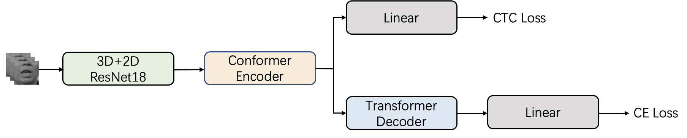

<h1 align="center">MAVSR2025 Track1 基线系统</h1>

## 简介

本仓库是MAVSR2025 Track1赛道的基线系统代码，用于完成一个基本的唇语识别任务。模型结构如下：



## 准备工作

1. 安装依赖库:

```Shell
# install accelerate
pip install accelerate
# install pytorch torchaudio torchvision
pip install torch==1.12.1+cu113 torchvision==0.13.1+cu113 torchaudio==0.12.1 --extra-index-url https://download.pytorch.org/whl/cu113
# install other dependence
pip install -r requirements.txt
```

2. 下载并处理竞赛提供的数据集

进入`data_preparation`进行数据处理和准备：

下载CAS-VSR-S101放在data/CAS-VSR-S101_zip/lip_imgs_96，进行处理：

```Shell
python zip2pkl_101.py
```

准备训练需要的labels：

```Shell
python create_labels.py
```

下载MOV20放在data/MOV20_zip/lip_imgs_96，进行处理：

```Shell
python zip2pkl_mov20.py
```

## 训练

构建词表（注意：默认去除标点符号进行训练）：

```Shell
cd data_meta/
# build vocabulary
python build_mapping_tokenizer.py
# get val/test ground truth
python get_trans.py
```

修改cfg中对应的配置文件的各个参数：

* 确保`dset_dir`和`trans_dir`分别对应数据集路径和标签所在路径

* 修改词表大小`vocab`

* 使用`max_len`(1000)，表示只使用帧长在1000帧以下的样本进行训练

模型训练：

```Shell
bash run_chinese_baseline.sh
```

在run_chinese_baseline.sh中指定参数：

* 指定accelerate配置文件路径`acc_cfg`

* 选择模型配置文件`cfg_ph`

* 指定gpu个数`ngpu`

## 验证和测试

进行模型验证和测试：

```Shell
bash run_chinese_baseline_test.sh
```

在run_chinese_test.sh中指定参数：

选择`train_path`路径下的模型进行推理，指定模型配置文件`cfg_ph`；

对`--start_epoch`到`--end_epoch`范围内的训练模型进行验证；

对前`--model_average_max_epoch`中最好的`--nbest`个模型平均后进行测试。

## 结果

下面的表格列出了在CAS-VSR-S101上训练的基线模型，在不同验证集和测试集上的结果：

| Training Data | Inference Data | CER on val | CER on test |
| :-----------: | :------------: | :--------: | :---------: |
| CAS-VSR-S101  |  CAS-VSR-S101  |   55.07%   |   47.74%    |
| CAS-VSR-S101  |     MOV20      |   93.05%   |   91.73%    |

## 联系方式

任何问题请联系：

邮箱：lipreading@vipl.ict.ac.cn